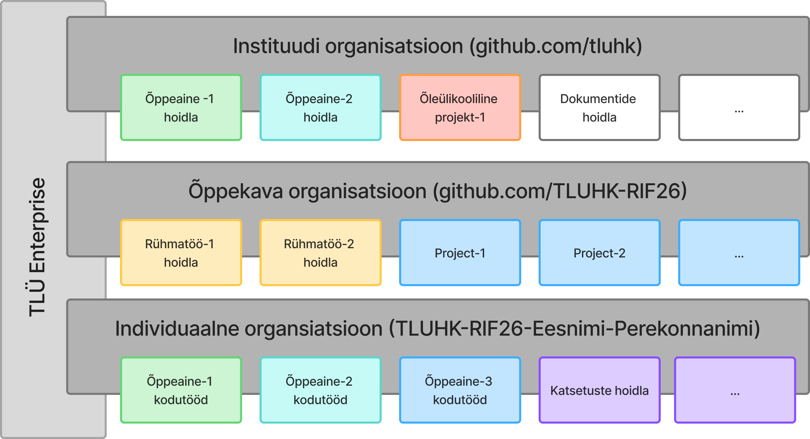
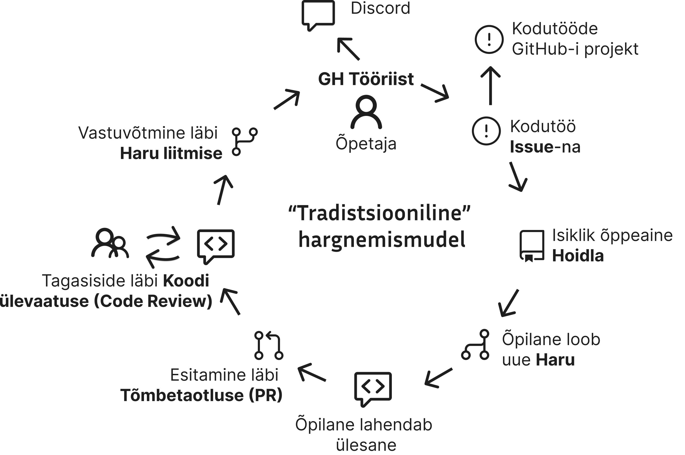
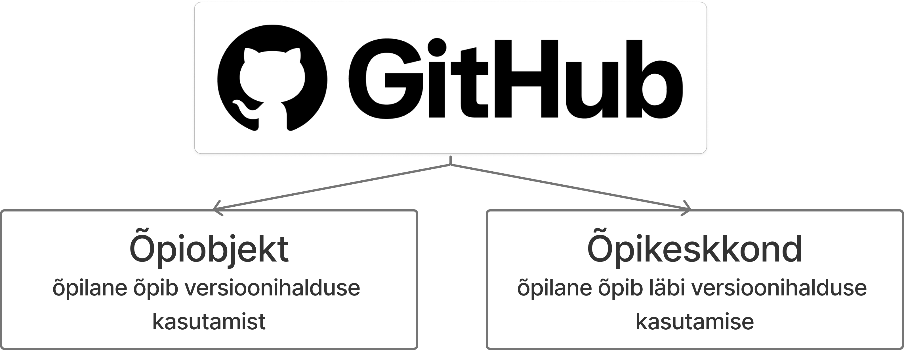

# GitHub õpikeskkond rakendusinformaatika õppekaval

## Sissejuhatus

Tere tulemast rakendusinformaatika õppekavale!

Praktilistes ainetes kasutame peamise õpikeskkonnana GitHubi. Kuigi GitHub on maailmas tuntud eelkõige tarkvaraarendajate versioonihalduse platvormina, on meie õppekaval sellest kujunenud terviklik õppekeskkond, kus toimub suur osa igapäevasest õppetegevusest.

GitHubis:

- antakse ülesandeid;
- arendatakse lahendusi;
- tehakse meeskonnatööd;
- antakse ja saadakse tagasisidet;
- dokumenteeritakse kogu tööprotsess;
- kujuneb sinu professionaalne portfoolio.

Meie eesmärk ei ole õpetada ainult programmeerimist. Sama oluline on õppida kasutama töövõtteid ja tööriistu, mida kasutatakse igapäevaselt tarkvaraarendusettevõtetes.

Kui mõni mõiste on uus, saad vajaduse korral kõrvale avada toetavad materjalid:

- [Versioonihaldus](concepts/Version-Control/README.md)
- [Git](concepts/Git/README.md)
- [GitHub](concepts/Github/README.md)
- [Markdown](concepts/Markdown/README.md)

---

## GitHubi ökosüsteem

Meie GitHubi keskkond koosneb kolmest organisatsiooni tüübist. Igal neist on oma kindel eesmärk ning koos moodustavad need tervikliku õpikeskkonna.

Kui püüda meie õpikeskkonna ülesehitust visualiseerida, siis võiks see olla midagi sellist:

## 1. Instituudi organisatsioon

Instituudi organisatsioon on kogu õppekava ühine keskkond.

Siin paiknevad näiteks:

- õppematerjalid;
- juhendid;
- näidisprojektid;
- ühised tööriistad;
- avalikud projektid.

Instituudi organisatsioon on koht, kust algab enamik õppetööst. Siit leiad vajalikud materjalid ning juhendid, mida erinevates ainetes kasutatakse.

Seda võib võrrelda ülikooli digitaalse raamatukogu ja tööriistakoguga.

Haapsalu kolledži rakendusinformaatika õppekava GitHubi organisatsiooni leiad siit: [Haapsalu kolledži rakendusinformaatika õppekava GitHubi organisatsioon](https://github.com/tluhk)

---

## 2. Õppekava organisatsioon

Igal lennul on oma GitHubi organisatsioon.

Näiteks:

**RIF26**

See organisatsioon ei ole mõeldud õppematerjalide hoidmiseks.

Selle peamine eesmärk on toetada kogu lennu ühist tegevust.

Õppekava organisatsioonis asuvad näiteks:

- üliõpilaste nimekiri koos viidetega nende isiklikele organisatsioonidele;
- grupiprojektid;
- ühised arendusprojektid;
- koostööülesanded;
- erinevad katsed ja pilootprojektid, mis puudutavad kogu õppekava või suuremat üliõpilaste rühma.

Lihtsamalt öeldes on see koht, kus kohtuvad kõik ühe lennu üliõpilased ning kus toimub nende ühine praktiline tegevus.

RIF26 õppekava organisatsiooni leiad siit: [RIF26 õppekava organisatsioon](https://github.com/TLUHK-RIF26)

---

## 3. Isiklik organisatsioon

Õpingute alguses saab iga üliõpilane oma GitHubi organisatsiooni.

See on sinu isiklik tööruum ning kõige olulisem osa kogu õppekeskkonnast.

Sinu organisatsioonis paiknevad:

- isiklikud aineprojektid;
- kodused tööd;
- praktilised harjutused;
- katsetused;
- isiklik portfoolio.

Erinevalt tavalisest GitHubi kasutamisest ei tööta sa üksikutes juhuslikes hoidlates, vaid haldad omaenda organisatsiooni.

See tähendab, et õpid lisaks programmeerimisele ka:

- hoidlate haldamist;
- projektide organiseerimist;
- õiguste haldamist;
- professionaalset töökorraldust.

Sinu organisatsioon jääb sulle alles ka pärast õpinguid ning sellest võib kujuneda oluline osa sinu professionaalsest portfooliost.

Sinu isikliku organisatsiooni aadress on tavaliselt kujul: `https://github.com/TLUHK-RIF26-<Eesnimi-Perekonnanimi>`

GitHubis võib hoidla nähtavus sõltuda sellest, millise konto või organisatsiooni all hoidla asub. Tavalised nähtavuse tasemed on **Public** ja **Private**. GitHub Enterprise'i organisatsioonides võib lisaks olla kasutusel ka **Internal** nähtavus.
>
> - **Public** vaade tähendab, et kõik GitHubi kasutajad näevad sinu organisatsiooni ja selle projekte.
> - **Internal** vaade tähendab, et hoidlat näevad sama GitHub Enterprise'i keskkonna liikmed, kellel on selleks ligipääs.
> - **Private** vaade tähendab, et ainult sina ja sinu määratud koostööpartnerid näevad sinu isiklikke projekte.
>   Vaikimisi on kõikide üliõpilaste organisatsioonid seatud Private vaatesse, mis tähendab, et ainult sina ja sinu määratud koostööpartnerid näevad sinu isiklikke projekte. Lisaks on vaikimisi õppeainete repositooriumitele ligipääs automaatselt õppeaine õpetaja(te)l ja õppekava juhil.

---

## Kes omab mida?

Kuigi kõik kolm organisatsiooni asuvad GitHubis, on neil erinevad omanikud ja erinevad eesmärgid.

| Organisatsioon            | Omanik           | Milleks kasutatakse?                                                                  |
| ------------------------- | ---------------- | ------------------------------------------------------------------------------------- |
| Instituudi organisatsioon | Tallinna Ülikool | Õppematerjalid, juhendid, näidisprojektid, ühised tööriistad                          |
| Õppekava organisatsioon   | Tallinna Ülikool | Üliõpilaste nimekiri, grupiprojektid, koostööprojektid ja kogu õppekava ühine tegevus |
| Isiklik organisatsioon    | Üliõpilane       | Isiklikud projektid, kodutööd, praktilised ülesanded ja portfoolio                    |

Selline ülesehitus võimaldab selgelt eristada, millised ressursid kuuluvad ülikoolile ning millised on sinu enda hallata.

---

## Kuidas ülesanded tavapäraselt liiguvad?

Enamik õppeaineid, mis kasutavad GitHubi, kasutavad seda ka koduste ülesannete andmisel ja lahenduste esitamisel. Tavaline töövoog on järgmine:

Sellist töövoogu kasutatakse väga paljudes tarkvaraarendusettevõtetes üle maailma. Õpingute jooksul harjud sellega loomulikul viisil ning omandad töövõtted, mida saad hiljem kasutada ka tööelus.

Kui see töövoog on sulle uus, aitavad järgmised materjalid:

- [Harudega töötamine](concepts/Branch/README.md)
- [GitHub Issue](concepts/Github-Issue/README.md)
- [Koodi ülevaatus](concepts/Code-Review/README.md)
- [Koodi ülevaatuse juhend](concepts/Code-Review-Guide/README.md)
- [Git ja GitHubi parimad praktikad](concepts/Git-Best-Practices/README.md)

Samas ei ole see ainukene kasutatav töövoog. Sageli kasutame ka lihtsalt GitHubi Issue-sse lisatavat kommentaari koduse ülesande lahendusena. Näiteks võib koduse ülesande lahenduseks olla arvamus või kirjeldus, mille lisad Issue kommentaarina. Sellisel juhul ei ole vaja luua eraldi haru ega Pull Request'i.

Sellest, kuidas koduste ülesannete lahendusi tavaliselt esitatakse, räägime eraldi koduseid ülesandeid andes ja kirjeldus on tavaliselt ka kirjas koduses ülesandes endas.

Siin tuleb muidugi meeles pidada ka seda, et kõik õpetajad/õppejõud ei kasuta GitHubi oma õppeainetes.

> Joonisel näidatud GH Tööriist on kolledži poolt loodud rakendus, mis võimaldab õpilastele edastada koduseid ülesandeid ja jälgida nende olekut. Selle eesmärk on lihtsustada õpetajate tööd ja toetada õpilaste õppimist. Tegemist on õpetajatele mõeldud tööriistaga ja õpilased sellega otseselt kokku ei puutu.

---

## GitHub Projects

Kodused ülesanded, mis tulevad läbi GitHubi, lisatakse automaatselt ka teie individuaalse organisatsiooniga seotud GitHub Project tahvlile. See võimaldab sul jälgida kõiki oma koduseid ülesandeid ühes kohas.

---

## Miks me kasutame GitHubi?

Meie lähenemise eesmärk on kasutada GitHubi nii õpiobjekti, kui õpikeskkonnana, milles mõlemad toetavad versioonihalduse õppimist.

GitHub võimaldab õppida palju enamat kui ainult koodi haldamist.

Õpingute jooksul õpid:

- kasutama versioonihaldust;
- planeerima ja dokumenteerima oma tööd;
- tegema koostööd teiste arendajatega;
- lahendama konflikte ja ühendama muudatusi;
- vastu võtma ning andma konstruktiivset tagasisidet;
- looma professionaalset arendusportfooliot.

Need oskused on tänapäeva tarkvaraarenduses sama olulised kui programmeerimisoskus.

Tarkvaraarenduse üldisema protsessi mõistmiseks vaata ka materjali [Tarkvaraarenduse elutsükkel (SDLC)](concepts/SDLC/README.md).

---

## Mida saad õpingute lõpuks?

Õpingute lõpus ei ole sul ainult läbitud ained.

Sul on olemas ka:

- professionaalselt korraldatud GitHubi organisatsioon;
- kümned tarkvaraprojektid;
- sadade või isegi tuhandete commit'ide ajalugu;
- pull request'id ja koodiülevaated;
- kogemus meeskonnatöös;
- professionaalne portfoolio, mida saad näidata tööandjale.

Meie eesmärk on, et õpingute jooksul kujuneks GitHub sinu igapäevaseks töövahendiks ning samal ajal kasvaks sellest välja usaldusväärne ülevaade sinu teadmistest, oskustest ja arengust.

---

## Discord

Lisaks GitHubile kasutame õppeprotsessi toetamiseks ka Discordi. Discord on suhtlusplatvorm, kus toimub igapäevane suhtlus, küsimuste esitamine ja vastuste saamine. Samuti on Discord integreeritud meie GitHubi õpikeskkonnaga, mis annab meile erinevaid võimalusi. Näiteks saad Discordi kaudu teavitusi oma tegemata koduste ülesannete kohta, nende staatuste muutusest (esitatud, vastu võetud jne) ning ka muudest olulistest teadetest.

---

## Mida võiks veel GitHubi põhise õpikeskkonna kohta teada?

Igale kolledži poolt hallatavasse organisatsiooni on paigaldatud GitHubi rakendus, mis saadab automaatselt kõik organisatsioonis toimunud sündmuste kohta kolledži poolt hallatavasse rakendusse, mille eesmärk on aru saada erinevate koduste ülesannetega seotud tegevustest, aru saada õpilaste aktiivsusest ja tegevuse kontekstist. See rakendus on loodud kolledži poolt ning selle eesmärk on toetada õppeprotsessi ja tagada, et kõik vajalikud tegevused oleksid jälgitavad.

Samuti kasutatakse GitHubis toimunud sündmuseid erinevates uuringutes, mille kohta küsitakse igalt õpilaselt eraldi nõusolekut.
